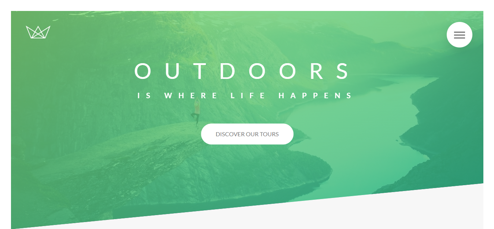

<h1 align="center"> ✈ NATOURS </h1>
<h2>Hakkında:</h2>
✨ Animasyonlar ve hover efektleri içeren, çeşitli destinasyonlara turlar düzenleyen ve farklı cihazlara uyumlu (responsive) olan Jonas Schmedtmann eşliğinde  oluşturduğum bu seyahat sitesini keşfedin.
<h3>🔴Projenin deploy edilmiş versiyonu : <a href="https://natours-site-project.netlify.app/">Natours</a></h3>
 
<h2> Kullandığım yapılar:</h2>
* Modal ve hamburger menu için javascript kullandım. 
* Daha düzenli ve okunabilir bir css kodu  için sass kullandım. 
* Kodu tekrarlamamak adına mixins kullandım. 
* Her bileşeni ayrı bir dosyada tutarak kodun daha organize ve yönetilebilir olmasını sağladım. 
* Projemde güncelleme durumları için pratik olması adına değişkenler tanımladım.

<h2> 🛠 Kullandığım teknolojiler:</h2>

 
 

<h2> GÖRSELLER :</h2>
<h2 align="center">HEADER SECTION</h2>

<h2 align="center">ABOUT SECTION</h2>

<h2 align="center">FEATURES SECTION</h2>

<h2 align="center">TOURS SECTION</h2>

<h2 align="center">TOURS SECTION HOVER</h2>

<h2 align="center">STORIES SECTION</h2>

<h2 align="center">BOOKING SECTION</h2>

<h2 align="center">FOOTER SECTION</h2>

<h2 align="center">NAVIGATION SECTION</h2>

<h2 align="center">MODAL SECTION</h2>

<h2>Geliştirici Bağımlılıklar:</h2>
* npm concat 
* npm autoprefixer 
* npm run all 
* npm postcss-cli 
* npm sass 
